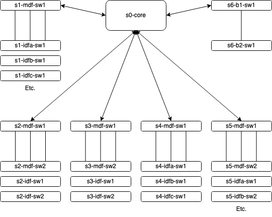

Ansible Roles and Plays for Cisco Network Hardware
==================================================
This Is Not Production Code!
----------------------------

This repository is for DEMONSTRATION ONLY, and is intended to illustrate how I use Ansible to manage an enterprise network environment. While informed by the needs and choices of my professional production environment, this repository reflects an independent lab environment, with invented IP schema, hostnames, keys, and other details. Additionally, the network architecture here is significantly simpler that what we run in production, and was built to illustrate concepts and examples of how to solve problems rather than trying to recreate every use case of a live environment.

Network Topology
----------------

This demonstration code is written for a simple, three-tier hub/spoke topology with six physical sites, like this:

The WAN topology and it's accompanying questions (MPLS or SD-WAN, E-Line or E-LAN) are outside the scope of this demonstration.

Each site has the following VLANs, each of which is assigned a unique ID tag:
  - Inline
  - Relay
  - Guest
  - Management
  - Surveillance Cameras
Each of subnets associated with these VLANs has a detailed access control list to police traffic at the site's distribution switch. Accordingly, these ACLs are defined in the Ansible "distro_switch" role.

Provisioning
------------

Zero-touch provisioning features are outside the scope of this repository. Whether by console connection, a bootstrapped Python script, or some other means, you must establish the following basic configuration to execute these Ansible playbooks:
- Default gateway
- Hostname
- Domain name
- SSH host keys
- Management interface
- Ansible user and SSH public key
- DNS servers
- VTY settings

Authentication
--------------

Ansible connects to the network hardware by means of a service account called `ansible`, which should be added to the configuration during provisioning.

Using this repository
---------------------

The global configuration state of the network is defined by the Ansible roles in this repository. Hostnames and host groups are defined in the inventory file, and each role is written to run against only the hostnames or groups that require it. This means you can safely execute all roles against all hardware thus:

    ansible-playbook network_state.yml -i network_inventory

Append `-l <hostname>` to limit the execution to a single host.

The `plays` and directory contains tasks rather than state configuration. They are intended to automate maintenance procedures; for example, `upgrade_ios.yml`. You would obviously not want to execute this play every time you make a global configuration change.
